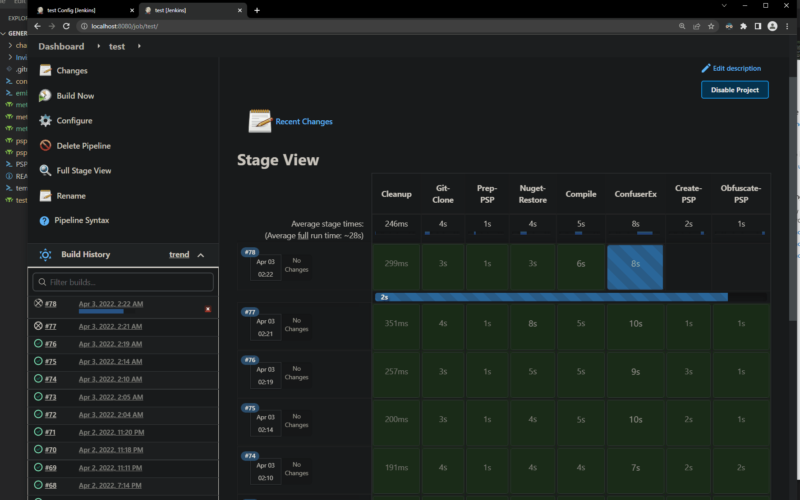

# DEPRECATED. Use Offensive-Jenkins instead. PUBLIC WHEN IDK

---

# jenkins-psp
PoC jenkins files for generating PowerSharpPack payloads

Refer to the [blog post here](https://blog.sunggwanchoi.com/half-automating-powersharppack/)

## Components 

### Jenkins - Main 
- psp-confuser.groovy: Jenkins pipeline that uses ConfuserEx for obfuscation. Creates PSP payload. 
- psp-inviscloak.groovy: Jenkins pipeline that uses InvisiblityCloak for obfuscation. Creates PSP payload.
- psp-invis-confuser.groovy: Jenkins pipeline that uses InvisibilityCloak + ConfuserEx. Creates PSP payload.
- assembly-invis-confuser.goorvy: Jenkins pipeline that uses InvisibilityCloak + ConfuserEx and only creates .NET assembly. 
- test-jenkins.groovy: A simple sanity check jenkins pipeline.

### Jenkins - Meta 
- meta-example.groovy: Meta job that invokes `meta-Certify.groovy` and `meta-Rubeus.groovy`. 
- meta-Certify.groovy: Jenkins pipeline that creates Certify PSP payload. 
- meta-Rubeus.groovy: Jenkins pipeline that creates Rubeus PSP payload. 

### Utility scripts 
- confuserEx.ps1: Creates confuserEx project (.crproj) file that `confuserex.cli.exe` will use. 
- embedDotNet.ps1: Embed .NET assembly into the `template.ps1` PSP payload template. 
- PSPprep.ps1: Change .NET tool's source code to set `public` for classes and the `main()` method. 
- template.ps1: A PSP payload template. .NET assembly will get embedded here. 

### Examples 
- Bunch of pipeline examples for popular projects 
    - Certify 
    - Rubeus 
    - SharpHound 
    - SharpUp
    - SharpView
    - Standin 
    - SharpDPAPI 

## Gotchas 
- Remove `welcome()` banner from `chameleon`, causes character encoding error with Jenkins.
- `psp-inviscloak.groovy` - If compilation fails because of invisibilitycloak, use the no-string option (remove `-m <obs>` option)
- Turn off defender!

## Credits 
- [@S3cur3Th1sSh1t](https://twitter.com/ShitSecure): For creating [PowerSharpPack](https://github.com/S3cur3Th1sSh1t/PowerSharpPack), and many other projects
- [@HTTP418InfoSec](https://twitter.com/HTTP418InfoSec): For the Jenkins [blog post](https://http418infosec.com/offsecops-using-jenkins-for-red-team-tooling), which led me down to a rabbit hole
- [@harmj0y](https://twitter.com/harmj0y): For the [SO-CON 2020 talk](https://www.youtube.com/watch?v=XaICChBJMck), which inspired HTTP418InfoSec to write his blog post
- [@h4wkst3r](https://twitter.com/h4wkst3r): For the [InvisibilityCloak](https://github.com/h4wkst3r/InvisibilityCloak) project
- [@xenosCR / Conor Richard](https://twitter.com/xenoscr): For the OffSecOps setup [blog post](https://blog.xenoscr.net/2020/11/28/OffSecOps-Basic-Setup.html)
- [@klezVirus](https://twitter.com/KlezVirus): For the [Chameleon](https://github.com/klezVirus/chameleon) project
